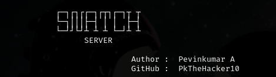

<p align="center">
  
</p>

<h1 align="center">🧠 Python Keylogger Simulation</h1>

<p align="center">
  An educational cybersecurity project demonstrating keystroke capture, encryption, and secure network transmission.
</p>

<p align="center">
  
  
  
  
</p>

---

## ⚠️ Disclaimer

> This project is strictly for **educational and ethical hacking purposes only**.  
> Do not use this on systems you do not own or have explicit permission to test.

Unauthorized use is illegal and unethical.

---

## 📂 Project Structure

```

keylogger_project/
├── snatcher.py        # Keylogger client
├── snatch-server.py   # Server receiver & decryptor
└── README.md

````

---

## 🚀 Features

- ⌨️ Captures keystrokes (including special keys)
- 🔐 Encrypts data using Fernet (AES-based encryption)
- 🔑 Uses PBKDF2-HMAC-SHA256 for secure key derivation
- 📡 Sends encrypted logs via TCP socket
- 🔓 Server decrypts and displays logs in real-time
- 🧪 Useful for cybersecurity education and malware behavior simulation

---

## 📦 Requirements

Install dependencies:

```bash id="p1kq9x"
pip install pynput cryptography
````

---

## 🛠️ Usage

### 1️⃣ Start Server (Receiver)

```bash id="server_run"
python3 snatch-server.py
```

---

### 2️⃣ Configure Client (Keylogger)

Edit `snatcher.py`:

```python id="cfg1"
HOST = "YOUR_SERVER_IP"
PORT = 12345
```

---

### 3️⃣ Run Keylogger Client

```bash id="client_run"
python3 snatcher.py &
```

---

## 🔄 How It Works

* Keystrokes are captured in real time
* Data is buffered until `Enter` is pressed
* A random **salt** is generated per message
* A secure key is derived using **PBKDF2-HMAC-SHA256**
* Data is encrypted using **Fernet (AES-based)**
* Encrypted payload is sent over TCP socket
* Server decrypts and prints original input

---

## 🧠 Educational Value

This project helps learners understand:

* Keylogging fundamentals (ethical awareness)
* Symmetric encryption in Python
* PBKDF2 key derivation concepts
* TCP socket communication
* Real-world malware behavior simulation (defensive study)

---

## 📸 Sample Output

```
[SERVER] Received Encrypted Packet
[✓] Decrypted Keystrokes:
hello world
login attempt detected
```

---

## ⚖️ License & Ethics

This project is intended for:

* Cybersecurity education
* Ethical hacking practice
* Defensive security research

❌ Do not use for unauthorized monitoring or malicious activity.

---

## 👤 Author

**Pevinkumar A**
Cybersecurity Learner | Python Developer | Ethical Hacking Enthusiast
